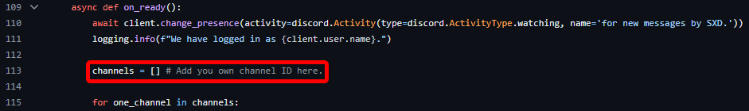
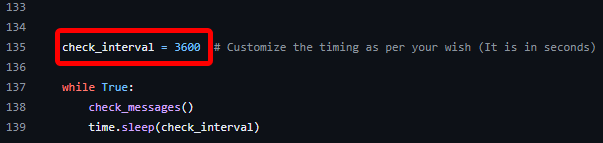
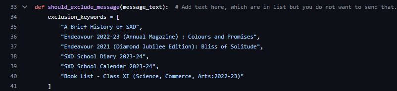
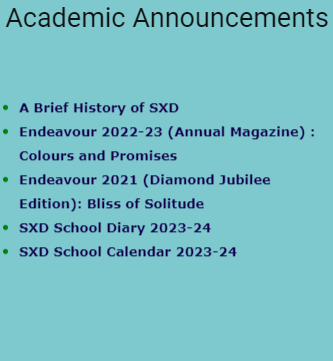

# SX-Dex

This bot scrapes messages from the SXD website and relays them to a Discord channel. It's designed to automate the notification process for new updates on the website. 🎉

### Why did I make this bot?

1. **Performance**: The school website is poorly optimized and takes forever to load.
2. **Convenience**: It's easier to open Discord and get updates rather than opening another browser tab. (Even easier on mobile, since the school's app is a complete mess.)
3. **Project Goals**: I wanted to create a useful Discord bot, unlike the last one, which was just for fun.

## Creating a Discord Bot
To set up your bot, you'll need to create a Discord application and generate a bot token. Here's how:

1. Go to the [Discord Developer Portal](https://discord.com/developers/applications).
2. Click on "New Application" and give your application a name.
3. Navigate to the "Bot" tab and click "Add Bot".
4. Click "Copy" under the token section to copy your bot token.

## **Installation**

1. **Clone the Repository:**

   ``` 
   git clone https://github.com/luc1d-ed/SX-Dex.git
   cd SX-Dex
   ```
    Alternatively, download the ZIP file and extract it.

2. **Install Dependencies:**
Ensure you have Python installed, then install the required packages using:

   ```
   pip install -r requirements.txt
   ```
3. **Set Up Environment Variable:**

    Create a `.env` file in the `Data` directory and add your Discord bot token:

    ```
    DISCORD_TOKEN="your_bot_token"
    ```
    Replace `your_bot_token` with your actual Discord bot token.

## Configuration

- **Channel:**
Add your channel ID on line 113.  


- **Check Interval:**
Customize the interval for website checks on line 135.  


- **Exclude Messages:**
Add messages to exclude in the `should_exclude_message` function starting at line 33.  


(These are the other list items on the website)

More specifically these:  


## Contributing

Feel free to open issues or submit pull requests for any improvements or bugs. 

### Further Instructions

There are more tasks to complete to get this bot fully operational. If you have any questions, search the internet—it's pointless to detail every minor step here.
